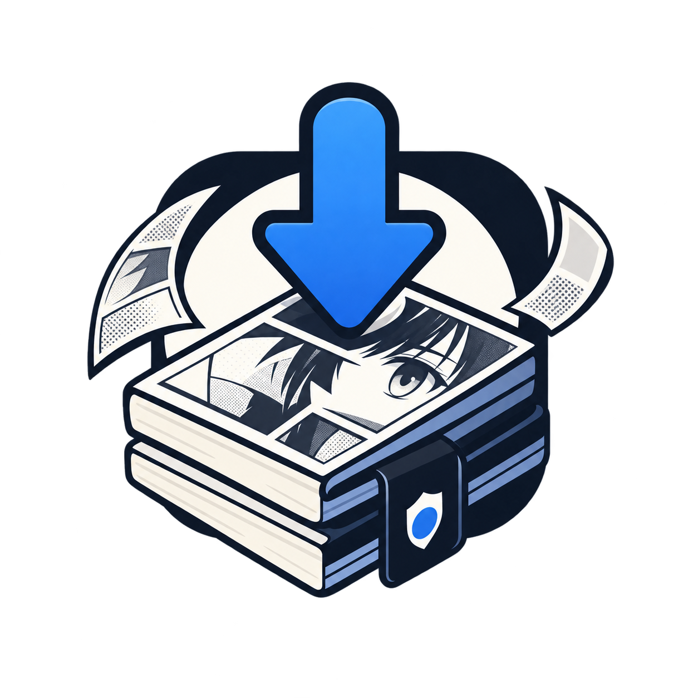

<p align="center">
  
</p>

<h1 align="center">iFetch</h1>

<p align="center">
  A fast, lightweight MangaKatana downloader and self-hosted manga archive server written in Rust.
</p>

---

## Overview

**iFetch** downloads manga series and chapters from MangaKatana directly into `.cbz` archives with corresponding `ComicInfo.xml` metadata.

You can run it as an interactive CLI tool or as a lightweight HTTP server. When running in server mode, it functions as a backend for reader apps like [Mihon](https://mihon.app) / Tachiyomi through the [ifetch-extension](https://github.com/FelixSiegel/ifetch-extension).

## Features

- **CBZ Packaging & Metadata**: Packages chapters into `.cbz` files containing full `ComicInfo.xml` metadata (title, series, number, volume, synopsis, genre, author).
- **Clean Folder Structure**: Downloads each manga into it's own folder and automatically calculates and maintains uniform zero-padding across chapter archives (e.g. `Chapter 001.cbz` vs `Chapter 100.cbz`).
- **Interactive CLI**: Search titles interactively or pass URLs directly, with support for flexible chapter selectors (`all`, `1-10`, `1,3,5.5`).
- **Self-Hosted Reader Server**: Exposes a REST API for searching, browsing, chapter reading, and on-demand background downloading.
- **Mihon / Tachiyomi Extension**: Seamlessly integrate your self-hosted library into Mihon with the [ifetch-extension](https://github.com/FelixSiegel/ifetch-extension).
- **Adaptive Rate Limiting**: Built-in pacing and Cloudflare challenge detection with burst allowances for immediate reading and exponential cooldown backoff.
- **Automated Library Updates**: Periodic cron checks automatically fetch newly released chapters for tracked manga with exponential backoff for finished series.
- **Minimal Resource Footprint**: Consumes ~2-20 MB RAM at idle or during basic navigation, peaking around ~70 MB during active reading via a bounded LRU image cache.
- **Discord Webhooks**: Optional progress, completion, and error notifications.

## Installation

### Docker

```bash
docker run -d \
  --name ifetch \
  -p 8080:8080 \
  -v /path/to/downloads:/app/downloads \
  -v /path/to/config:/app/config \
  -e DISCORD_WEBHOOK_URL="https://discord.com/api/webhooks/..." \
  ghcr.io/felixsiegel/ifetch:latest
```

#### Docker Compose

```yaml
services:
  ifetch:
    image: ghcr.io/felixsiegel/ifetch:latest
    container_name: ifetch
    restart: unless-stopped
    ports:
      - "8080:8080"
    volumes:
      - ./downloads:/app/downloads
      - ./config:/app/config
    environment:
      - IFETCH_PORT=8080
      - IFETCH_THREADS=2
      - IFETCH_CRON_HOURS=12
      - DISCORD_WEBHOOK_URL=
```

### Building from Source

Requires Rust (1.85+).

To just install, you can use:

```bash
cargo install --git https://github.com/FelixSiegel/ifetch
```

or if you want the full project source:

```bash
git clone https://github.com/FelixSiegel/ifetch.git
cd ifetch
cargo build --release
```

The compiled binary will be located at `target/release/ifetch`.

## Usage

### CLI Mode

```bash
# Interactive prompt (search manga and select chapters)
ifetch

# Search directly and download all chapters
ifetch "One Piece" --chapters all

# Download specific chapter ranges
ifetch "https://mangakatana.com/manga/..." --chapters 1-20

# Multi-threaded download
ifetch "Berserk" -t 4

# List available chapters without downloading
ifetch "Chainsaw Man" --list
```

### Server Mode

```bash
# Run the HTTP server on port 8080
ifetch --server --port 8080 --output ./downloads --config ./config
```

### Configuration & Environment Variables

| Variable              | CLI Flag          | Default     | Description                                                     |
| :-------------------- | :---------------- | :---------- | :-------------------------------------------------------------- |
| `IFETCH_SERVER`       | `--server`        | `false`     | Run as an HTTP server                                           |
| `IFETCH_PORT`         | `-p`, `--port`    | `8080`      | Port for the HTTP server                                        |
| `IFETCH_OUTPUT`       | `-o`, `--output`  | `downloads` | Directory for manga archives                                    |
| `IFETCH_CONFIG`       | `-C`, `--config`  | `config`    | Directory for SQLite DB and config                              |
| `IFETCH_THREADS`      | `-t`, `--threads` | `1`         | Concurrent chapter download threads                             |
| `IFETCH_VERIFY`       | `--verify`        | `false`     | Check chapters for updates an re-download if necessary          |
| `IFETCH_CRON_HOURS`   | —                 | `12`        | Interval in hours for automatic chapter checks (`0` to disable) |
| `DISCORD_WEBHOOK_URL` | —                 | `None`      | Optional webhook URL for Discord alerts                         |

## Mihon / Tachiyomi Extension

If you run iFetch in server mode, you can connect your mobile reader app using the official extension:

👉 **[ifetch-extension](https://github.com/FelixSiegel/ifetch-extension)**

Once installed, point the extension's address setting to your iFetch server URL (e.g., `http://your-server-ip:8080`). You can browse, read cached chapters, and trigger background downloads directly from your mobile device.

## Disclaimer

This software is intended strictly for personal use, offline reading, and archiving purposes. **iFetch** does not host, store, or own any copyrighted materials; all metadata and images are retrieved from third-party sources. Please support the original authors, publishers, and official release platforms.
